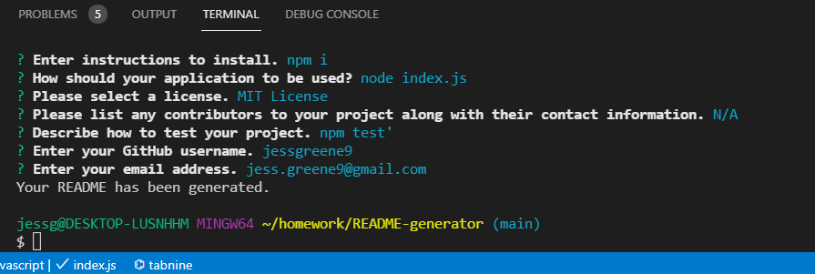
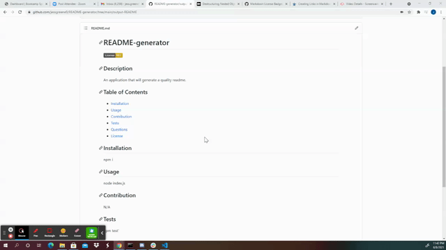

# README-generator
[](https://opensource.org/licenses/MIT)

An application that prompts the user to enter information in the command line that will generate a quality README file. 
  
## Table of contents

- [Description](#description)
- [Demonstration](#demonstration)
- [Screenshots](#screenshots)
- [Installation](#installation)
- [Usage](#usage)
- [Tech/Framework](#tech/framework)
- [Contributions](#contributions)
- [Contact](#contact)
- [License](#license)


## Description

This application allows the user to easily create a quality README.md file. The user uses the command line in the terminal to initialize the application and is then prompted for information about their project that will be needed in order to create a complete README. The user is prompted with questions covering the following information: 

   * Title of project
   * Description of project
   * Installation instructions
   * Application usage
   * License for the project
   * Collaboration
   * Testing the application
   * Github username
   * Email address

## Demonstration
[click here](https://drive.google.com/file/d/1BY7f9Qeo1xrw-t0VdAp7VHjU0ZmK3qUz/view)


## Screenshots

?


## Installation
This application requires the installment of 'inquirer' and 'fs' to run properly. To install the required dependencies, please run:
  ```
      npm i
  ```


## Usage
After the required dependencies are installed, open the index.js file and run the following command line and follow the prompts:
  ```
    node index.js
  ```


## Tech/Framework

VS Code

## Contributions

This project was made with help from:

* UNCC BootCamp class
* My tutor, Josh Furlin

## Contact

    
For any questions about this project, please visit my GitHub page: [GitHub Profile](https://github.com/jessgreene9)
      
Or email me at: [Jess Greene](mailto:jess.greene9@gmail.com)

## License

[](https://opensource.org/licenses/MIT)
  
  